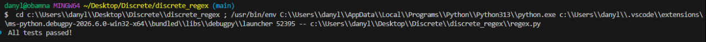
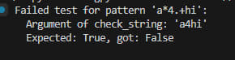

# discrete_regex
# Лабораторна робота: Скінченні автомати та Regex

Цей проєкт реалізує спрощений механізм регулярних виразів (Regex) за допомогою **скінченних автоматів (FSM)** та патерну проектування **State (Стан)**.

## 1. Пояснення імплементації

Програма побудована на принципах об'єктно-орієнтованого програмування з використанням ієрархії станів.

### Архітектура станів (State Pattern)

Кожен символ або оператор у регулярному виразі перетворюється на окремий об'єкт стану:

* **`StartState`**: Початкова точка автомата.
* **`AsciiState`**: Очікує на конкретну літеру або цифру.
* **`DotState`**: Реалізує оператор `.`, приймаючи будь-який символ.
* **`StarState`**: Реалізує квантифікатор `*` (0 або більше повторень). Дозволяє "пропустити" стан або повернутися до нього.
* **`PlusState`**: Реалізує квантифікатор `+` (1 або більше повторень). Схожий на зірочку, але вимагає хоча б одного успішного збігу.
* **`TerminationState`**: Кінцевий стан. Якщо автомат досягає його після обробки всього рядка — рядок вважається валідним.

### Логіка роботи `RegexFSM`

1. **Компіляція**: При створенні об'єкта `RegexFSM(regex_expr)`, конструктор проходить по кожному символу виразу та будує ланцюжок станів, з'єднуючи їх через список `next_states`.
2. **Обробка зірочки та плюса**: Коли зустрічається `*` або `+`, попередній створений стан модифікується або обгортається у відповідний об'єкт (`StarState`/`PlusState`), що змінює логіку переходів (додаються цикли або можливість переходу "вперед" через епсилон-зв'язки).
3. **Перевірка рядка**: Метод `check_string` ітерує по вхідному рядку. Для кожного символу викликається `_check_next_with_epsilon`, яка намагається знайти наступний валідний стан.

---

## 2. Інструкції до запуску


### Запуск

1. Скопіюйте код у файл, наприклад `main.py`.
2. Відкрийте термінал або консоль у папці з файлом.
3. Запустіть програму командою:
```bash
python main.py

```


---

Ось оновлений розділ **«3. Приклади запусків та результати»**, який ідеально відповідає вашій новій структурі тестів. Ви можете просто скопіювати цей блок і замінити ним стару частину у вашому `README.md`.

---

## 3. Приклади запусків та результати

Для перевірки коректності роботи скінченного автомата реалізовано автоматизований скрипт з набором тестів, який перевіряє різні патерни (зокрема `.`, `*`, `+` та їх комбінації).

### Приклад коду для тестування (фрагмент):

```python
tests = [
    ("a.c", "abc", True),
    ("a.c", "ac", False),
    ("ab*c", "abbbc", True),
    ("a*4.+hi", "aaaaaa4uhi", True),
    ("a*4.+hi", "hi", False),
]

all_passed = True
for pattern, text, expected in tests:
    regex = RegexFSM(pattern)
    actual = regex.check_string(text)

    if actual != expected:
        print(f" Failed test for pattern '{pattern}':")
        print(f"   Argument of check_string: '{text}'")
        print(f"   Expected: {expected}, got: {actual}\n")
        all_passed = False

if all_passed:
    print(" All tests passed!")

```

### Результат успішного запуску:

Якщо всі імплементовані стани відпрацьовують правильно, консоль виведе:

```text
 All tests passed!

```

### Результат у разі помилки (приклад):

Якщо логіка автомата десь хибить (наприклад, дозволяє рядок, який мав би бути відхилений), скрипт вкаже на конкретний випадок:

```text
  Failed test for pattern 'a*4.+hi':
   Argument of check_string: 'a4hi'
   Expected: True, got: False

```

### Скріншот результатів:




## 4. Висновки

В ході роботи було реалізовано механізм регулярних виразів через NFA (недетермінований скінченний автомат). Використання патерну **State** дозволило уникнути складних конструкцій `if-else` всередині основного циклу перевірки, переклавши відповідальність за логіку переходів на окремі об'єкти станів. Це робить код гнучким для розширення (наприклад, додавання оператора `?` або логічного АБО `|`).
